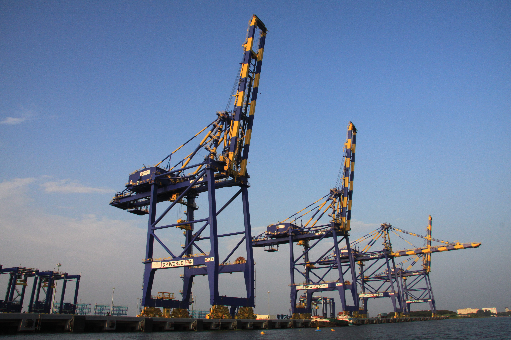

---

## Introduction to Docker

###Matt Oswalt
###@Mierdin
###keepingitclassless.net

<!-- 
BEFORE YOU START - create a docker machine per lab 01
-->

---

# Disclaimers

<!--
Just a disclaimer on what I'll be covering....in short,
I do have a day job, and this is not that.
-->

Nothing in this presentation should be viewed to reflect any opinion or infrastructure detail of any employer, past or present, or any other organization. What I present is mine.

This should not be perceived to reflect the actual implementation of any specific real-world technology or infrastructure deployment, unless otherwise explicitly stated.

---

# Notes about this workshop

- This is an INTRO
- Invent your own "right" way
- All resources online
  - https://github.com/Mierdin/intro-to-docker-workshop

<!--

This will not be totally exhaustive. I don't have enough time in the webinar to go deep with everything - and I wanted to provide an introduction to Docker. My goal is to show you enough to get started with Docker in a meaningful way, but there will be some parts I'll have to gloss over due to time. The good news is that Docker's documentation is pretty good.

Docker is like Git. (version control) There are many workflows through Docker - and there isn't really a "right" way. I will be presenting what I believe are some of the most common workflows and practices when working with Docker, but you should continue this exploration on your own. The labs that I've created should help with this.

Finally, ALL of the resources I'm going through are online in a Github repository. Feel free to follow along using that URL.

-->

---

# We will accomplish...

- Understanding "Why Docker?"
- Basics of Docker
- Interactive "take-home" examples for each topic

<!--

If I've done my job, we'll accomplish several things by the end of this webinar:

First, we'll answer the question "Why Docker?" What does Docker do for us? Whether we're a software developer, infrastructure operator - what is it that makes Docker useful? We will answer these questions very shortly.

We'll also explore some of the basics of what's "under the hood" with Docker, but mostly this webinar focuses on how to actually USE docker. If you'd like to dive deep on anything in particular that I may not have covered in this webinar, let me know via Twitter and I'll be happy to help you out or point you to additional resources.

Finally, as mentioned before, everything we'll do in this webinar is on Github - so you will definitely have some stuff to play with once this webinar is over. I don't personally view my job as "finished" if you leave this webinar with nothing to play with on your own time.

-->

---

# Why Docker?

<!--

So let's start with that first question: Why Docker?

The best answer to this question actually came in the form of an analogy that Solomon Hykes (creator of Docker, and then-CEO of dotcloud) gave when he demo'd Docker at Pycon 2013.

The image you see there on the screen shows a few massive cranes used for moving shipping containers on and off of ships, or to trains or trucks. The system in place to do this follows a set of standards and designs, such that an interesting relationship between the cargo and it's transportation is formed. Specifically, the crane operator doesn't need to have any knowledge of what's inside a shipping container, in order to get it where it needs to go. Similarly, the customer who owns that cargo doesn't need to be an expert crane operator or truck driver in order to get their cargo from one side of the world to the other. This forms a contract that says, if you use this standard, you can work with this system.

Docker is positioned to implement a similar solution for "shipping" software from a developer's laptop, into production. Until Docker, there really wasn't an easy way to get code into production without operations having some kind of knowledge about that specific application. Docker provides a useful abstraction for getting an application into production that can be applied to all kinds of different applications and languages.

In the same way that the crane operator doesn't need to know what's inside the shipping container, operations engineers don't need to know the details of what's inside a Docker container in order to deploy the application inside.

-->

---

# Docker Use Cases

- Faster Development
- Dev-to-Prod simplification
- Less overhead, more density

<!--

Docker enables faster application development because it is a lighter-weight format for developing applications. Developers no longer have to fire up entire virtual machines that represent their target platform - they can do their same workflows within a container, and as a result, get features out more quickly.

The aforementioned crane analogy also helps code get from a developer's laptop to production with fewer problems - because it follows a consistent format. This cuts down on talk like "well it worked on my laptop!"

Finally, containers in general are useful because they do not require a duplicate copy of an operating system in order to function - they can share a single OS, cutting down on resource requirements. This is especially useful in production when achieving density is a critical matter.

-->

---

# Docker Under the Hood

- Namespaces
    - pid
    - mount
    - net
- UnionFS
- cgroups

<!--

As mentioned before, I'd like to talk briefly about what's under the hood with Docker, though the rest of this webinar will focus almost exclusively on how to use it.

That said, you should know a few terms. First off, you should definitely become familiar with the concept of a Linux namespace. There are several different types of namespaces - and a few examples are:

- The "net" namespace provides network interface isolation
- The "pid" namespace provides for process isolation (we'll see that in our containers, the running process is PID 1)
- The "mount" namespace provides for storage isolation - so that each running container has a different view of the underlying filesystem.

You should also be aware that Docker images use a specific filesystem known as UnionFS. This is one of the key technologies that allows Docker images to be so lightweight. We'll talk about this in more detail when we talk about images.

Finally, control groups or "cgroups" allow the host operating system to place limits or constraints on the system resources that a container can consume. This is especially useful in production environments that are running workloads from many different sources.

Now, these are all useful technologies for making Docker work, and it's definitely helpful to understand these on your road to leveraging Docker in production - but this is an intro, so from now on, we're going to focus on how to actually use Docker.

-->

---

# [fit] Lab 01 - Docker Basics

---

# Images

- Docker Images != VMs (very lightweight)
    - UnionFS
- Identified by UUID (like everything else)
- Intermediate Containers

<!--

The way that Docker handles container images is very lightweight and modular. It uses a special file system called UnionFS(http://unionfs.filesystems.org/) that allows separate filesystems (branches) to be overlaid to form a single coherent filesystem.

Knowing this, it's best to think of Docker "Images" as really just "diffs" (if you've ever used a diff tool). When you build your own custom Docker image - which is an exercise we'll work through in the next lab - then you're actually just creating an image that contains the changes you've made to the image you started with. This is why when you do an image pull, most of the time you see multiple downloads - Docker needs to download the changes that image made, but also all of it's base images, in order to run a full container.   

Images are identified by UUID, just like anything else in Docker.

When you're building your own image - changes to an image are actually created inside a container called an "intermediate container", and the resulting image from that change is then overlaid on the original image. Normally these containers are cleaned up so that after a build, the only thing left is the entire image you wanted to create, from the base image.

-->

---

# [fit] Lab 02 - Docker Images

---

# Volumes

* Volumes are a data persistence mechanism
* Image != (App) Data

<!--

Volumes in Docker are a data persistence mechanism.

What does this mean? Well first you have to understand that the docker image - for instance the one that we just built - is not the same thing as application data, or at least it shouldn't be. For instance - if we have a container running a mysql database, we'll probably have the mysql server installed on that container as part of the image, since it probably doesn't change too much. However, the files that store database contents should be stored on a volume, separate from the image. This allows Docker to treat this data differently.

Note that some workloads don't need volumes. You may have some kind of stateless application that pretty much just processes data without storing it - like a GUI front-end, etc. Sometimes, containers are a scaling mechanism and are inherently stateless - the persistence is elsewhere, like a back-end API server. However, there are some applications where it makes sense to hold state in or near the container itself - volumes are how this is accomplished.

-->

---

# [fit] Lab 03 - Docker Volumes

---

# The Docker Family

* Engine = Core Tech
* Machine = Automated Provisioning
* Swarm = Clustering, Scheduling
* Compose = Define Multi-Container Apps
* Registry = "Private Docker Hub"
* Kitematic = Desktop GUI

<!-- 

Up until now, we've really only been talking about one product in the Docker family - "Engine".

-->

---

# Container Cluster Scheduling

- Datacenter-as-a-machine
- Usually provides a provisioning API

<!--
START THE SWARM BUILD HERE

Allows you to treat a set of machines as a single machine. At least that's the goal. When you start an application on your computer, you don't worry about which CPU core that process is assigned to - that's the job of the OS to monitor resource utilization across all core and ensure assignment follows some kind of strategy. Container schedulers work in a very similar way, just across a cluster.

Usually containers are not deployed machine at a time. Containers tend to be deployed programmatically, so schedulers are typically bundled with some kind of API that is conducive to this - again, cluster-wide. Examples include Docker Swarm, Kubernetes, etc.

-->

---

# Docker Swarm

* Brings the Docker API to a cluster of hosts
* Schedules Containers - like OS scheduler, but for cluster
* Requires dist. K/V store (etcd, consul, etc)

---

# [fit] Lab 04 - Docker Swarm

---

# Docker Networking

- "Old-school networking" (pre 1.9)
- Socketplane Acquisition and Libnetwork

<!--

Networking in Docker before version 1.9 was a significant pain point.

Remember that the default multi-host networking story is one thing, but libnetwork actually provides a nice plugin architecture that allows for other mechanisms
Talk also about the fact that this solves the app-to-app problem.

-->

---

# [fit] Lab 05 - Multi-Host Networking

---

# Docker Compose

* Containers don't usually run in isolation
* Compose is a DSL for mapping containers to form an application

---

# [fit] Lab 06 - Docker Compose

---

# Resources

- https://twitter.com/mierdin
- https://keepingitclassless.net
- https://github.com/Mierdin/intro-to-docker-workshop